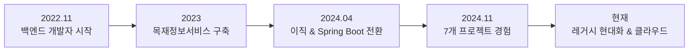

<div align="center">


# 👋 안녕하세요, 백엔드 개발자 장철준입니다

[](https://github.com/jcj145)
[](https://github.com/jcj145?tab=followers)

**"배움을 멈추지 않는 개발자"**

</div>

<br/>

## 🙋‍♂️ About Me

```
💼  3년 경력의 백엔드 개발자
🔧  Java/Spring 기반 공공·교육 시스템 개발
🎯  안정적인 시스템 운영 및 성능 최적화에 관심
📚  클린 코드, 테스트, AWS 학습 중
```

<br/>

---

## 💼 Work Experience

<table>
<tr>
<td width="50%">

### 🏢 (주)이데링크
**주임 · 백엔드 개발**  
📅 2024.04 ~ 현재

- 교육기관 시스템 개발
- Spring Framework, HTML 전환
- AWS S3 파일 관리 시스템 구축

</td>
<td width="50%">

### 🏢 (주)에코누리시스템
**사원 · 백엔드 개발**  
📅 2022.11 ~ 2024.11 (2년)

- 공공기관 웹 시스템 개발
- 외부 API 연동 시스템 구축
- eGovFramework 기반 개발

</td>
</tr>
</table>

<br/>

---

## 🚀 Key Projects

<details open>
<summary><b>📊 목재정보서비스 구축 및 운영</b> (2022.11 ~ 2024.11, 2년)</summary>

<br/>

**🎯 프로젝트 개요**
- 산림청 발주 목재 유통 정보 관리 시스템
- 3차에 걸친 구축 및 고도화 프로젝트

**💡 주요 성과**
```
✅ 외부 연동 API 성공률 97% 달성 (월 5,000건 처리)
✅ 수작업 데이터 입력 80% 자동화
✅ 쿼리 최적화로 응답 시간 60% 개선 (2.5s → 1.0s)
✅ 2년간 시스템 가동률 99.2% 유지
```

**🛠 기술 스택**
- `Java 8` `JSP` `eGovFramework` `PostgreSQL` `MyBatis`
- `Apache POI` `Quartz Scheduler`

**📌 담당 업무**
- 테이블 설계 및 CRUD 개발
- 외부 기관 데이터 연계 API 개발 (JSON 전송, 재시도 로직)
- Excel 업로드/다운로드 대용량 처리
- N+1 쿼리 최적화 및 배치 작업 구현

</details>

<details>
<summary><b>🎓 광운대학교 참빛인재양성 통합관리시스템</b> (2024.04 ~ 2024.10, 7개월)</summary>

<br/>

**🎯 프로젝트 개요**
- 학생 팀 프로젝트 및 멘토링 관리 시스템

**💡 주요 성과**
```
✅ 30개 팀, 300명 학생 데이터 안정적 관리
✅ 프로젝트 관리 효율 40% 향상
✅ AWS S3 연동으로 파일 관리 시스템 개선
```

**🛠 기술 스택**
- `Java 8` `Spring Framework` `JSP` `MariaDB` `AWS S3`

**📌 담당 업무**
- 팀 프로젝트 관리 모듈 개발
- 멘토-멘티 매칭 시스템 구현
- 첨부파일 AWS S3 연동
- 활동 보고서 승인 워크플로우

</details>

<details>
<summary><b>🏫 계약학과 운영지원 플랫폼</b> (2024.09 ~ 2024.11, 3개월)</summary>

<br/>

**🎯 프로젝트 개요**
- 기업-대학 매칭 자동화 시스템

**💡 주요 성과**
```
✅ 수동 매칭 업무 70% 자동화
✅ 실시간 통계 대시보드 구현
```

**🛠 기술 스택**
- `Java 11` `Spring Framework 6.3` `Thymeleaf` `MariaDB`

**📌 담당 업무**
- 기업 수요와 대학 학과 자동 매칭 알고리즘 개발
- Chart.js 기반 통계 대시보드 구현

</details>

<br/>

---

## 🛠 Tech Stack

### 💻 Backend
<p>


</p>

### 🗄 Database & ORM
<p>


</p>

### 🔧 Tools & Infrastructure
<p>


</p>

### 📚 Libraries
<p>


</p>

<br/>

---

## 📈 GitHub Stats

<div align="center">


</div>

<div align="center">

[](https://github.com/jcj145)

</div>

<br/>

---

## 🏆 Career Highlights



<br/>

### 💪 핵심 역량

| 분야 | 상세 |
|------|------|
| **API 개발** | REST API 설계, 외부 연동, JSON 통신, 재시도 로직 |
| **데이터 처리** | Excel 대량 업로드, 배치 스케줄러, 쿼리 최적화 |
| **성능 최적화** | N+1 문제 해결, 인덱스 설계, 응답 시간 개선 |
| **시스템 운영** | 장애 대응, 모니터링, 99% 이상 가동률 유지 |
| **협업** | SVN/Git, Redmine/Jira, 코드 리뷰 |

<br/>

---

## 🎯 주요 기술 경험

<table>
<tr>
<td width="33%" align="center">

### 🔗 외부 API 연동
**월 5,000건 처리**
- REST API 통신
- JSON 직렬화
- 재시도 로직
- 이력 관리

</td>
<td width="33%" align="center">

### 📊 대용량 데이터 처리
**80% 자동화**
- Excel 업로드/다운로드
- Apache POI
- 배치 스케줄러
- Quartz

</td>
<td width="33%" align="center">

### ⚡ 성능 최적화
**60% 개선**
- N+1 쿼리 해결
- 인덱스 설계
- 쿼리 튜닝
- 캐싱 전략

</td>
</tr>
</table>

<br/>

---

## 📚 Learning & Growth

### 🌱 현재 학습 중
- Clean Code & Refactoring
- TDD (JUnit, Mockito)
- AWS (EC2, RDS, S3)
- Docker & CI/CD
- Kubernetes 기초

### 📖 읽은/읽는 책
- 📘 Effective Java
- 📗 스프링 부트와 AWS로 혼자 구현하는 웹 서비스
- 📙 데이터베이스 첫걸음

<br/>

---

## 🎨 Portfolio

### 📂 [DashBoard - 팀 협업 관리 시스템](https://github.com/jcj145/DashBoard)

> **JSP 레거시에서 Spring Boot로의 현대화 경험**


**Features**
- 🔐 JWT 기반 인증/인가
- 📋 칸반보드 프로젝트 관리
- 💬 실시간 알림 (WebSocket)
- 📊 통계 대시보드
- 📦 파일 업로드 (AWS S3)

<br/>

---

## 📫 Contact & Links

<div align="center">

[](mailto:your.email@gmail.com)
[](https://github.com/jcj145)
[](https://linkedin.com/in/yourprofile)
[](https://your-blog.com)

</div>

<br/>

---

<div align="center">

### 💬 "안정적이고 확장 가능한 시스템을 만드는 개발자가 되겠습니다"

<br/>

**⭐ 함께 성장할 수 있는 기회를 기다립니다 ⭐**

<br/>


</div>
